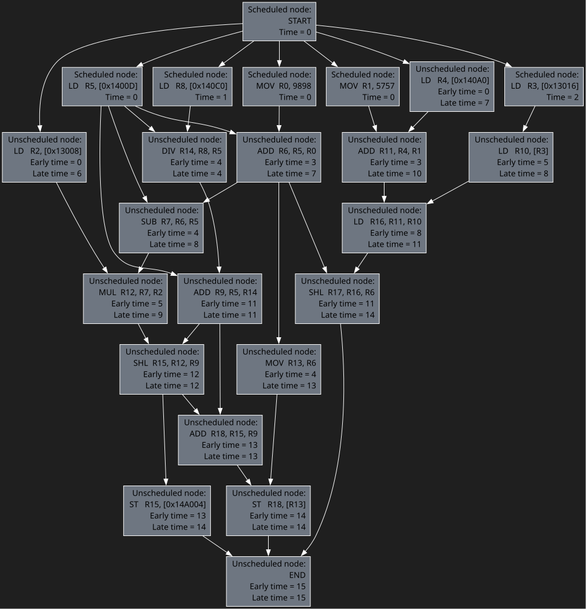

# Instruction scheduler

Data-dependency, latency and resource-aware instruction scheduler

Instructions and execution units configurations are given in TOML files

Input assembly must be in SSA form


```assembly
Input:                          Result:

                                | Cycle |          Unit | Instruction          |
                                |-------|---------------|----------------------|
LD   R2, [0x13008]              |     0 |           LSU | LD   R5, [0x1400D]   |
LD   R3, [0x13016]              |       |        Arithm | MOV  R0, 9898        |
LD   R4, [0x140A0]              |       | ArithmComplex | MOV  R1, 5757        |
MOV  R1, 5757                   |     1 |           LSU | LD   R8, [0x140C0]   |
LD   R5, [0x1400D]              |     2 |           LSU | LD   R3, [0x13016]   |
MOV  R0, 9898                   |     3 |           LSU | LD   R2, [0x13008]   |
ADD  R6, R5, R0                 |       |        Arithm | ADD  R6, R5, R0      |
LD   R8, [0x140C0]              |     4 | ArithmComplex | DIV  R14, R8, R5     |
SUB  R7, R6, R5                 |       |           LSU | LD   R4, [0x140A0]   |
LD   R10, [R3]                  |       |        Arithm | SUB  R7, R6, R5      |
ADD  R11, R4, R1                |     5 |           LSU | LD   R10, [R3]       |
MUL  R12, R7, R2                |       |        Arithm | MOV  R13, R6         |
MOV  R13, R6                    |     6 | ArithmComplex | MUL  R12, R7, R2     |
DIV  R14, R8, R5                |     7 |        Arithm | ADD  R11, R4, R1     |
ADD  R9, R5, R14                |     8 |           LSU | LD   R16, R11, R10   |
SHL  R15, R12, R9               |    11 |        Arithm | ADD  R9, R5, R14     |
LD   R16, R11, R10              |       | ArithmComplex | SHL  R17, R16, R6    |
SHL  R17, R16, R6               |    12 |        Arithm | SHL  R15, R12, R9    |
ADD  R18, R15, R9               |    13 |        Arithm | ADD  R18, R15, R9    |
ST   R15, [0x14A004]            |       |           LSU | ST   R15, [0x14A004] |
ST   R18, [R13]                 |    14 |           LSU | ST   R18, [R13]      |
                                |    15 |               | END                  |

```




<a href="tests/code/lecture_example.s">Code</a> and <a href="tests/configs/lecture_example/">configuration</a> of this example

## Build dependencies

- `C++ 20` compiler
- `CMake`

## Build

```bash
cmake -S . -B <build_dir> -DCMAKE_BUILD_TYPE={Debug, Release} [-DUSE_SANITIZER='Address;Undefined']
cmake --build <build_dir>
```

E.g:

```bash
cmake -S . -B build -DCMAKE_BUILD_TYPE=Debug -DUSE_SANITIZER='Address;Undefined'
cmake --build build
```

## Dependencies

- `dot` - graphviz tool for graph visualization

## Usage

```
Data-dependency, latency and resource-aware instruction scheduler
Usage:
  instruction-scheduler [OPTION...] <output>

  -i, --input arg         Input file with instructions
  -o, --output arg        Output file with scheduled instructions
  -u, --units arg         Config file with execution units description
                          (default: assets/units.toml)
  -x, --instructions arg  Config file with instructions (default:
                          assets/instructions.toml)
  -d, --dump_dir arg      Directory for graphs dumps. Dumps won't be
                          generated if not specified
  -h, --help              Print help
```

E.g:
```bash
./build/instruction-scheduler -i tests/code/all_instructions.s out.txt -d dumps
```

### Unit configuration

Unit configuration example:
```toml
[LSU]
quantity = 2
```

Each unit requires a unique name, which you will reference in the instruction configuration

### Instruction configuration

Several examples:

```toml
[load_imm]
symbol = [ "LD" ]
arguments = [ "rd", "mem_imm" ]
latency = 3
memory_order = "STRICT"
units = [ "LSU" ]

[simple_arithm_rs_imm]
symbol = [ "ADD", "SUB", "SHL", "SHR" ]
arguments = [ "rd", "rs", "imm" ]
latency = 1
units = [ "Arithm", "ArithmComplex" ]
```

- `symbol` - list of assembly instruction aliases
- `arguments` - list of arguments. Used for assembly parsing. In assembly `,` is the delimiter. Possible values:
    - `rd` - destination register (e.g. `R10`)
    - `rs` - source register (e.g. `R10`)
    - `imm` - immediate value. Can be binary, decimal, octal or hex (with `0b`, `0` and `0x`)
    - `mem_imm` - memory operand with immediate address (e.g. `[0x123]`)
    - `mem_rs_imm` - memory operand with register + immediate address (e.g. `[R10]`, `[R10+0x123]`)
- `latency` - instruction latency
- `memory_order` - obligatory for instructions with memory operands. Possible values:
    - `NON_MEMORY` - (default) no ordering rules
    - `RELAXED` - no ordering rules, but specifies that this is memory instruction
    - `STRICT` - can not be reordered with other instructions with same ordering
- `units` - list of units names which can execute this instruction. The earlier in the list, the higher the priority

## Credits

MIPT Baikal Electronics department Compiler Technologies course task

